# GoOutside-frontend

## Team Trident
### Group members:

*   Cuiqi Zheng
*   Lingxin Ma
*   Xiao Ma

### Project name: GoOutside

### Goal:

Provide a platform for users who enjoy outdoor activities to explore and review nearby places of interest. Activity types may include hiking, camping, kayaking, etc.

### Functions:

*   login/logout
*   search by name
*   filter by tag
*   add/remove outdoor activity
*   add, edit, delete review with photos
*   add to favorites

### Pages:

*   home page
*   activity introduction (review) page
*   upload activity page
*   favorite page

## #Iter1:
### Heroku App frontend: https://gooutside-frontend.herokuapp.com
### Heroku App backend: https://gooutsides.herokuapp.com 

### Team member contribution:
* Everyone contributed equally amount.
* Everyone is involved in the wireframe design, transition from boilerplate, and actual app backend and frontend initial set up (structural) coding.
* Each team member's concentrations are as follows:
  * Cuiqi focuses on js files implementation in frontend, particual about add/edit activity funcions, and set up MongoDB atlas and Amazon S3. 
  * Lingxin focuses on database entries, js files implementation in frontend, particular about activity page and overall frontend styling. 
  * Xiao focuses on backend implementation,including all controllers and DAOs, and backend-frontend connection.

## Current Screenshots
### Front page
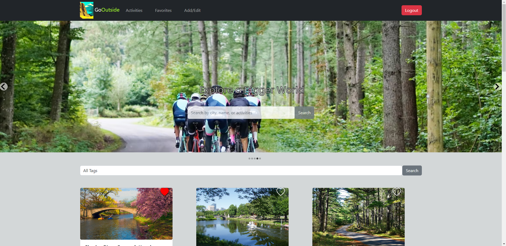 
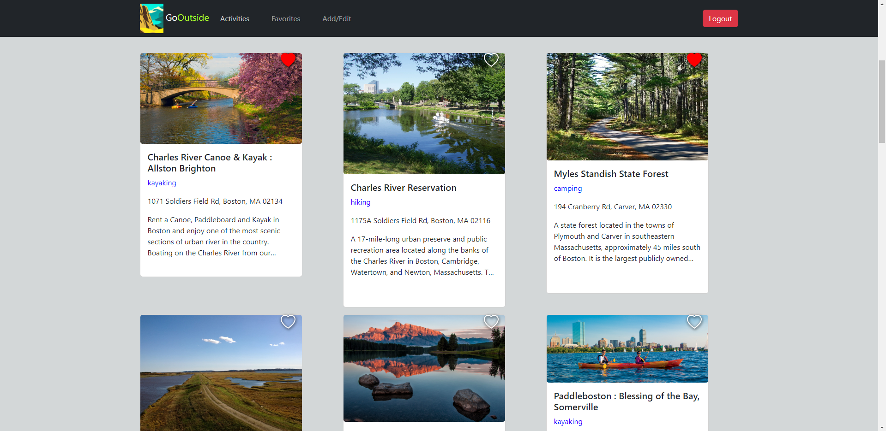
### Favorites page
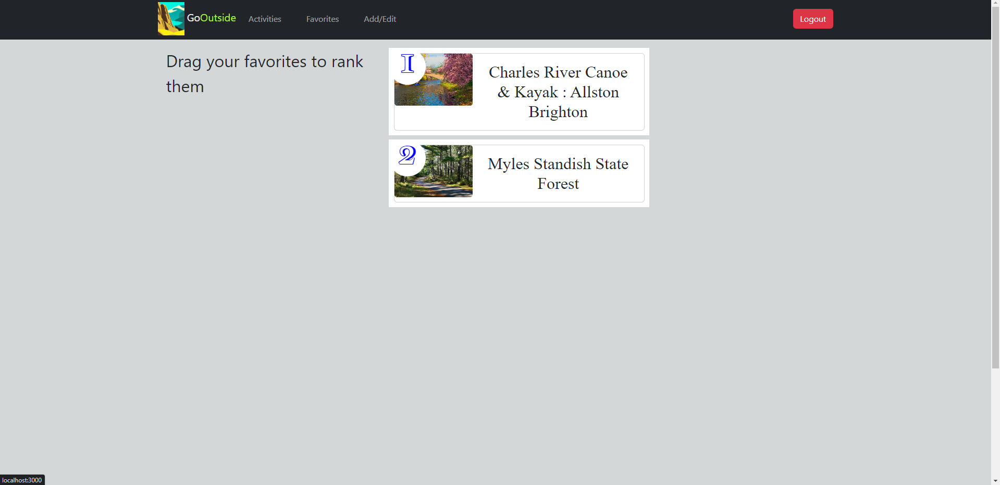
### Add new activity page
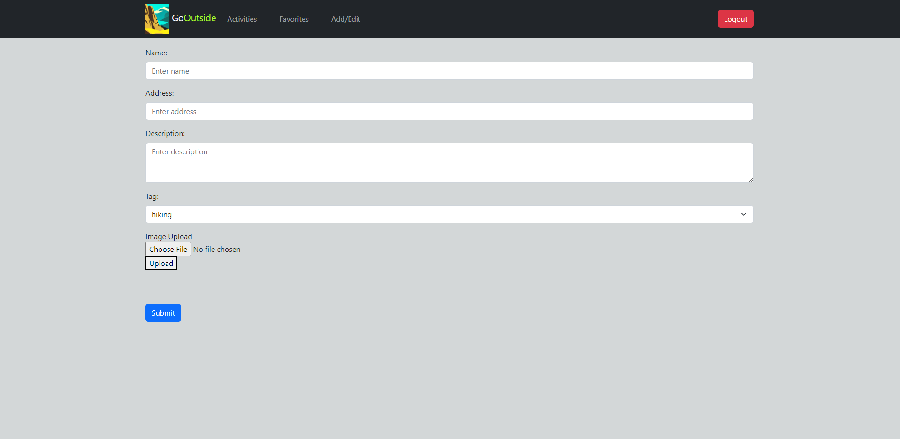

## #Iter2:
### Heroku App frontend: https://gooutside-frontend.herokuapp.com
### Heroku App backend: https://gooutsides.herokuapp.com 

### Team member contribution:
* Everyone contributed equally amount.
* In addition to contributions made on last iter, everyone is engaged in overall debugging.
* Each team member's concentrations are as follows:
  * Cuiqi focused on implementing activity editing, designing component showing coordinate array and image status, and Implementing getting coordinate and deleting images.
  * Lingxin focused on implementing slideshow and maps with location display in activity page, displaying star rating on each activity, website layout with overall styling, and updating readme. 
  * Xiao focused on implementing "My activities" page, including display of activities and delete activity function. Added getActivityByUserId and updateRating function in backend.

## Current Screenshots
### Front page
 
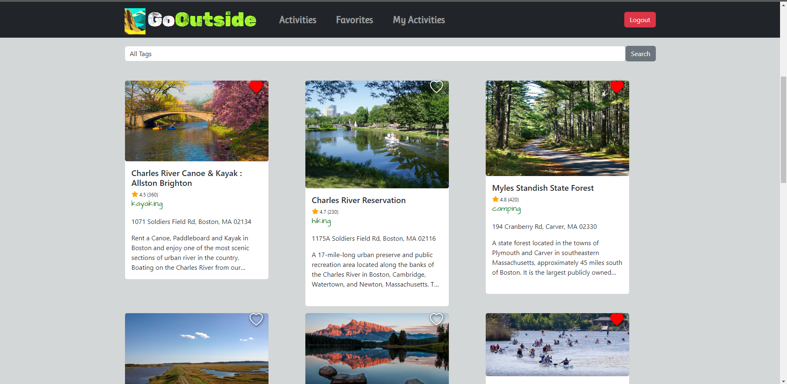
### Favorites page
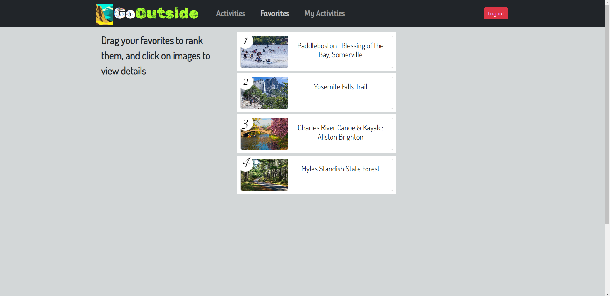
### Activity page
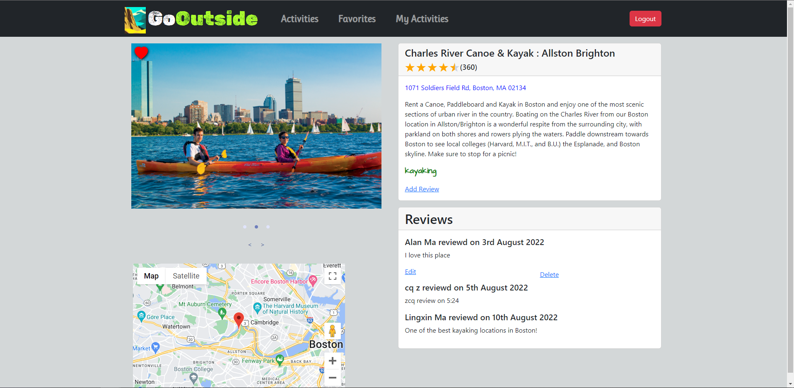
### Add review page
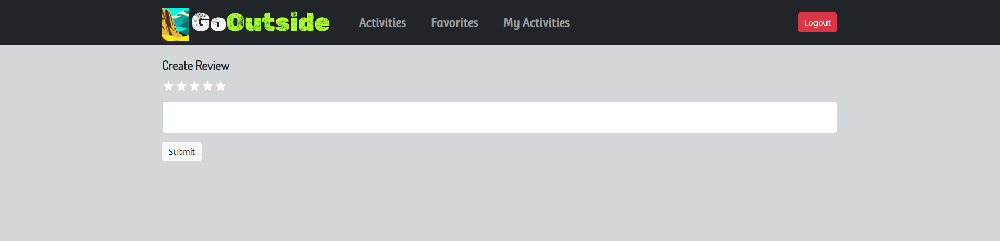
### My Activity page
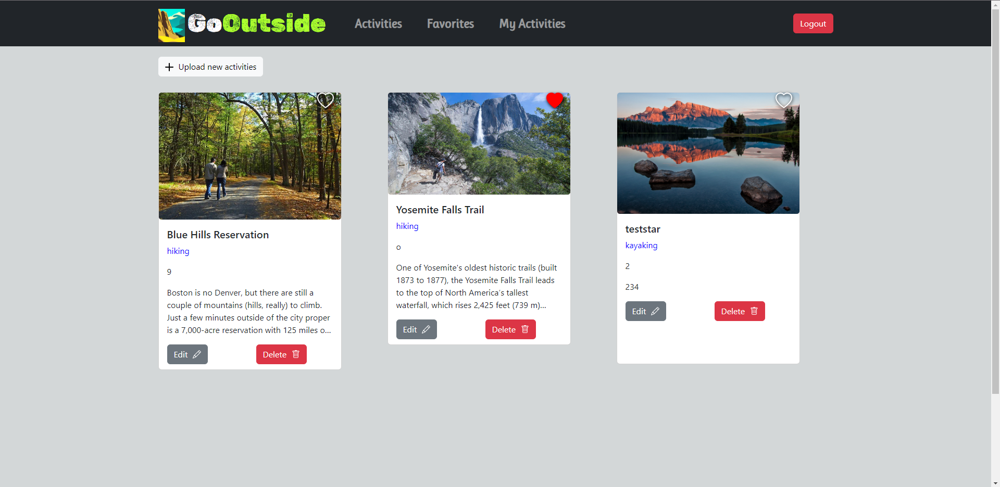
### Add activity page
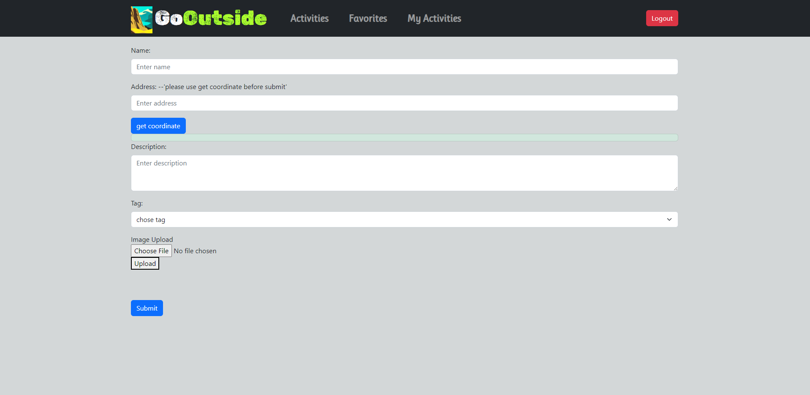
### Delete activity page
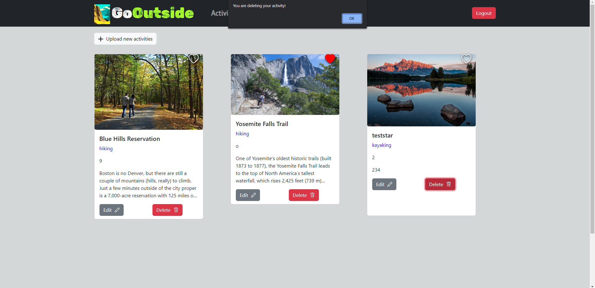

## Notes
* Star ratings are arbitrary and for demo purpose only
  
## #Iter3:
### Heroku App frontend: https://gooutside-frontend.herokuapp.com
### Heroku App backend: https://gooutsides.herokuapp.com 

### Team member contribution:
* Everyone contributed equally amount.
* In addition to contributions made on last iter, everyone is engaged in overall debugging.
* Each team member's concentrations are as follows:
  * Cuiqi focused on implementing getcoordinate fuction and adjusting nav bar style.
  * Lingxin focused on implementing website's responsiveness, handling delete activity exception, website overall styling, and updating readme. 
  * Xiao focused on implementing add activity function in backend, fixing delete activity function in backend and fixing update rating problem.

## Current Screenshots
### Front page
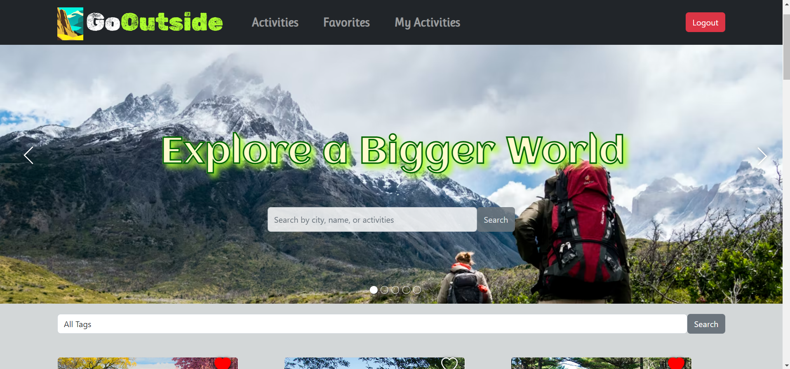 
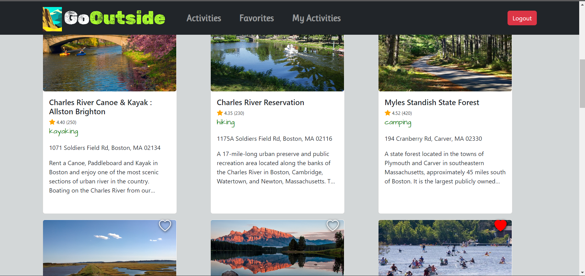
### Favorites page
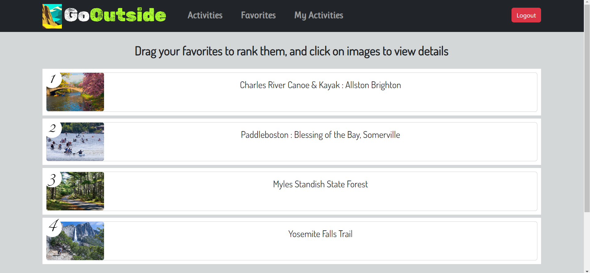
### Activity page
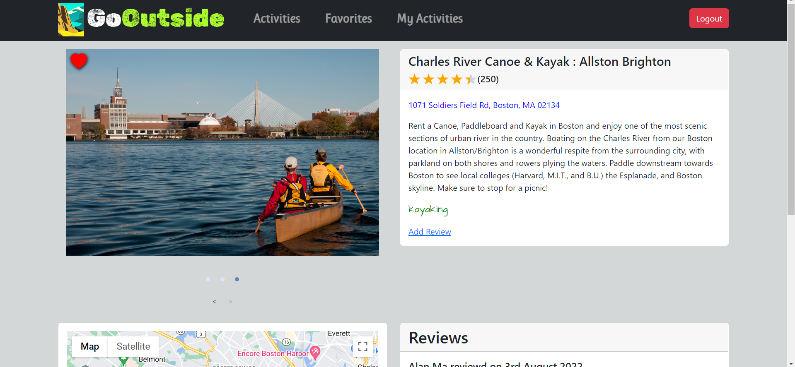
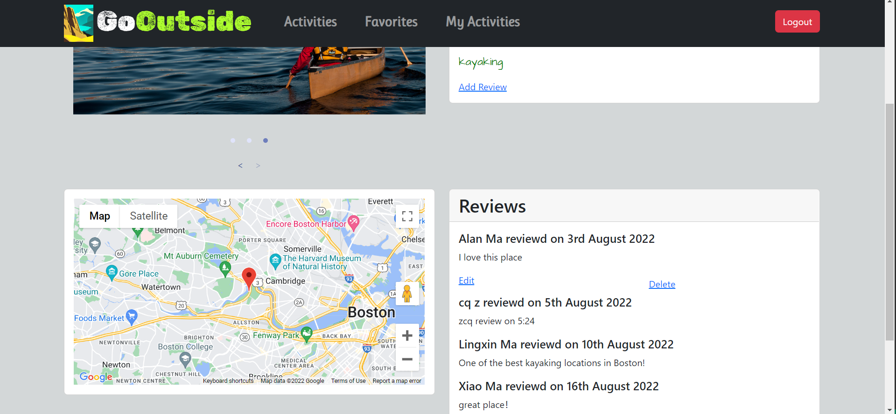
### Add review and rating page
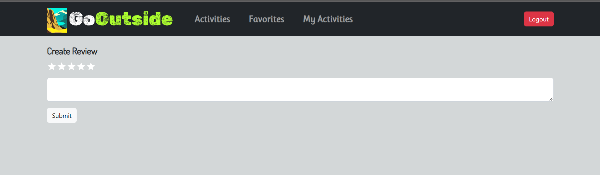
### My Activity page

### Add activity page
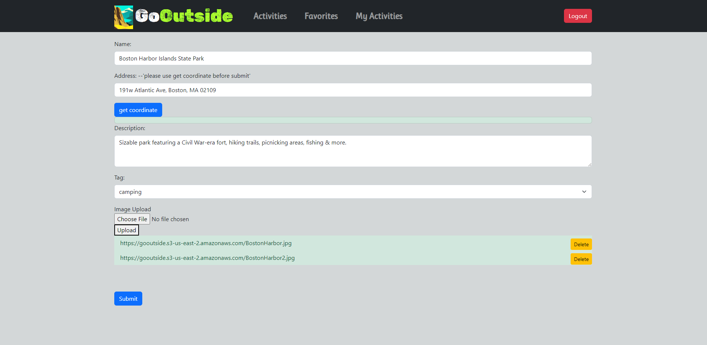
### Delete activity page
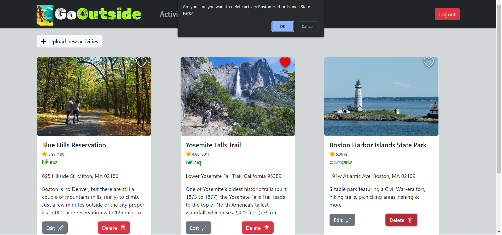

#
# Getting Started with Create React App

This project was bootstrapped with [Create React App](https://github.com/facebook/create-react-app).

## Available Scripts

In the project directory, you can run:

### `npm start`

Runs the app in the development mode.\
Open [http://localhost:3000](http://localhost:3000) to view it in your browser.

The page will reload when you make changes.\
You may also see any lint errors in the console.

### `npm test`

Launches the test runner in the interactive watch mode.\
See the section about [running tests](https://facebook.github.io/create-react-app/docs/running-tests) for more information.

### `npm run build`

Builds the app for production to the `build` folder.\
It correctly bundles React in production mode and optimizes the build for the best performance.

The build is minified and the filenames include the hashes.\
Your app is ready to be deployed!

See the section about [deployment](https://facebook.github.io/create-react-app/docs/deployment) for more information.

### `npm run eject`

**Note: this is a one-way operation. Once you `eject`, you can't go back!**

If you aren't satisfied with the build tool and configuration choices, you can `eject` at any time. This command will remove the single build dependency from your project.

Instead, it will copy all the configuration files and the transitive dependencies (webpack, Babel, ESLint, etc) right into your project so you have full control over them. All of the commands except `eject` will still work, but they will point to the copied scripts so you can tweak them. At this point you're on your own.

You don't have to ever use `eject`. The curated feature set is suitable for small and middle deployments, and you shouldn't feel obligated to use this feature. However we understand that this tool wouldn't be useful if you couldn't customize it when you are ready for it.

## Learn More

You can learn more in the [Create React App documentation](https://facebook.github.io/create-react-app/docs/getting-started).

To learn React, check out the [React documentation](https://reactjs.org/).

### Code Splitting

This section has moved here: [https://facebook.github.io/create-react-app/docs/code-splitting](https://facebook.github.io/create-react-app/docs/code-splitting)

### Analyzing the Bundle Size

This section has moved here: [https://facebook.github.io/create-react-app/docs/analyzing-the-bundle-size](https://facebook.github.io/create-react-app/docs/analyzing-the-bundle-size)

### Making a Progressive Web App

This section has moved here: [https://facebook.github.io/create-react-app/docs/making-a-progressive-web-app](https://facebook.github.io/create-react-app/docs/making-a-progressive-web-app)

### Advanced Configuration

This section has moved here: [https://facebook.github.io/create-react-app/docs/advanced-configuration](https://facebook.github.io/create-react-app/docs/advanced-configuration)

### Deployment

This section has moved here: [https://facebook.github.io/create-react-app/docs/deployment](https://facebook.github.io/create-react-app/docs/deployment)

### `npm run build` fails to minify

This section has moved here: [https://facebook.github.io/create-react-app/docs/troubleshooting#npm-run-build-fails-to-minify](https://facebook.github.io/create-react-app/docs/troubleshooting#npm-run-build-fails-to-minify)
